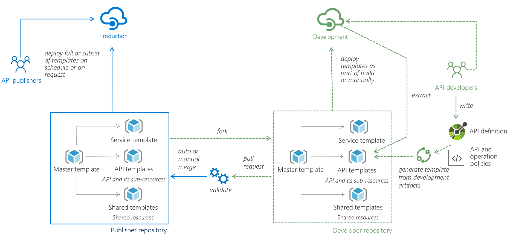

https://stackoverflow.com/questions/46017245/how-to-handle-unauthorized-requestsstatus-with-401-or-403-with-new-httpclient

sqlpackage.exe /TargetDatabaseName:testing /TargetServerName:"." /Action:Publish /SourceFile:"C:\dacpac\testing.dacpac" /p:DropObjectsNotInSource=true
# Azure API Management DevOps Resource Kit

APIs have become mundane. They have become the de facto standard for connecting apps, data, and services. In the larger picture, APIs are driving digital transformation in organizations.

With the strategic value of APIs, a continuous integration (CI) and continuous deployment (CD) pipeline has become an important aspect of API development. It allows organizations to automate deployment of API changes without error-prone manual steps, detect issues earlier, and ultimately deliver value to end users faster.

This repository provides [guidance](./README.md), [examples](./example/), and [tools](./src/APIM_ARMTemplate/README.md) to help you achieve API DevOps with Azure API Management.

## The Problem

Organizations today normally have multiple deployment environments (e.g., Development, Testing, Production) and use separate API Management instances for each environment. Some of these instances are shared by multiple development teams, who are responsible for different APIs with different release cadence.

As a result, customers often come to us with the following challenges:

* How to automate deployment of APIs into API Management?
* How to migrate configurations from one environment to another?
* How to avoid interference between different development teams who share the same API Management instance?

We believe the approach described below will address all these challenges.

## CI/CD with API Management

The proposed approach is illustrated in the below picture. You can also [watch this video](https://www.youtube.com/watch?v=4Sp2Qvmg6j8) which explains the approach as well as demonstrates a sample implementation. 

In this example, there are two deployment environments: Development and Production, each has its own API Management instance. API developers have access to the Development instance and can use it for developing and testing their APIs. The Production instance is managed by a designated team called the API publishers.

The key in this proposed approach is to keep all API Management configurations in Azure [Resource Manager templates](https://docs.microsoft.com/azure/azure-resource-manager/resource-group-authoring-templates). These templates should be kept in a source control system. We will use GIT throughout this example. As illustrated in the picture, there is a Publisher repository that contains all configurations of the Production API Management instance in a collection of templates.

* **Service template**: contains all the service-level configurations of the API Management instance (e.g., pricing tier and custom domains). 
* **Shared templates**: contain shared resources throughout an API Management instance (e.g., groups, products, loggers). 
* **API templates**: include configurations of APIs and their sub-resources (e.g., operations, policies, diagnostics settings). 
* **Master template**: ties everything together by [linking](https://docs.microsoft.com/en-us/azure/azure-resource-manager/resource-group-linked-templates) to all templates and deploy them in order. If we want to deploy all configurations to an API Management instance, we can just deploy the master template. Meanwhile, each template can also be deployed individually.

API developers will fork the publisher repository to a developer repository and work on the changes for their APIs. In most cases, they will focus on the API templates for their APIs and do not n
